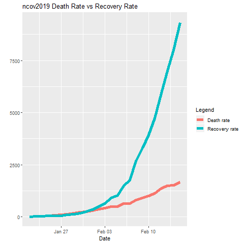
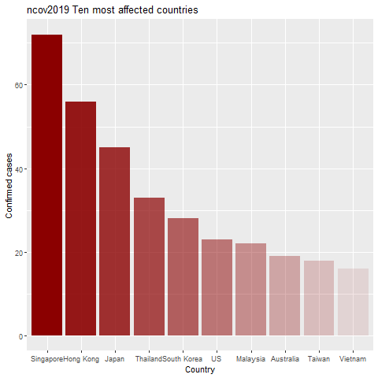
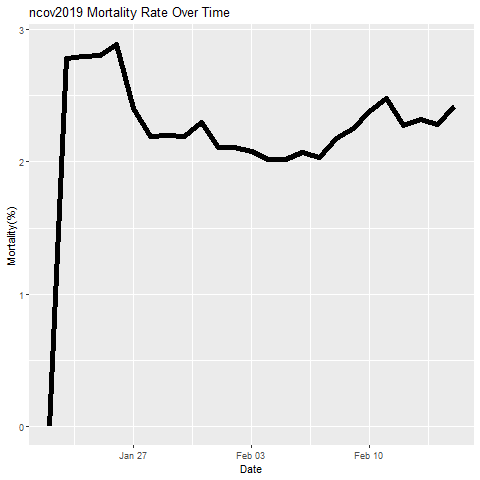
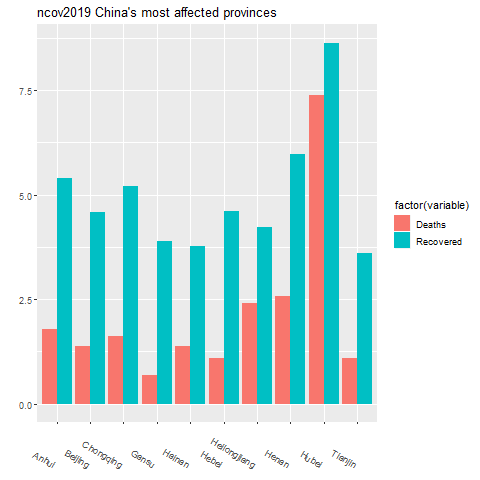
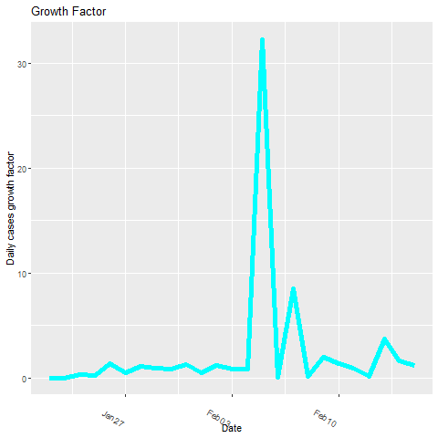
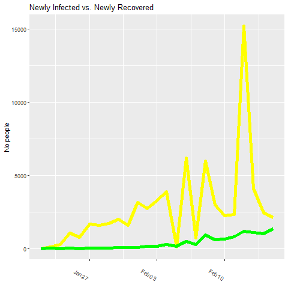

#Coronavirus outbreak
A virus first reported in the city of Wuhan,China, has spread to numerous countries across the world, generating health and economic concerncs.The "World Health Organization" ( WHO ) has declared the outbreak of the Wuhan coronavirus “a public health emergency of international concern”.
The purpose of this project is to showcase a preview of evolution of the Wuhan virus.
##The dataset used
We used the "Novel Corona Virus 2019 Dataset" created by John Hopkins University.The dataset is available at <https://www.kaggle.com/sudalairajkumar/novel-corona-virus-2019-dataset> .
The dataset contains:
<br>

1. Sno: index
3. Date: date of reported cases
4. Region/State: region/state
5. Country: country where cases have been reported
6. Last updated: last time modified
7. Confirmed: confirmed cases of infection,
8. Deaths: cases where the virus caused death
9. Recovered:cases of patients that recovered
  
##Preparing the data


We can see that data is reported cumulatively


We drop the **Sno** and **Last updated** columns,as they provide no useful information.<br>
```ncov = ncov[c(-1,-5)]```<br>

We also check that there are no duplicate rows.
```cat("All rows are unique: ",nrow(ncov)==nrow(unique(ncov)),"\n")```

We remove time from Date as it is not consistent,then we sort the dataset by date.


The data show that the virus has spread across 35 countries across the globe.

The impact on each country:<br>


Number of cases for each category plus daily stats:


##Visual representations
###Number of confirmed cases over time


###Rate of death vs rate of recovery


###The first ten most affected countries, besides China


###Mortality rate over time


###A look into China's most affected provinces


###Daily growth factor of the virus

###Newly Infected vs. Newly Recovered

##Obs
####The number of cases reported daily has increased by nearly 250% since the 28th of January. The number of cases reported on the 4th of February was 3915. This shows that the virus is highly contagious and is spreading rapidly.
####During the first week, the rate of deaths was roughly the same with that of recoveries. Since the 1st of February, the rate of recovery has shot up and is showing a positive trend.
####Countries geographically close to China, like Thailand or Japan have reported more cases than other Asian and European countries. Germany is an exception and has the highest number of cases in Europe.
####The mortality rate has never crossed 3% and seems to stabilize around 2%. 
####The province of Hubei is the epicentre of the outbreak. It has significantly more reported cases than all the other provinces together. 
####The virus has (with one exception,a negative growth rate)
##Conclusion
####The analysis shows the alarming rate at which the Wuhan coronavirus is spreading.Currently 1664 people have died because of the virus, exceeding SARS outbreak's 774 victims 7 years ago.
